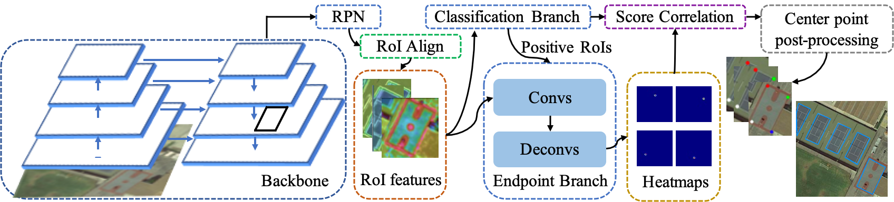
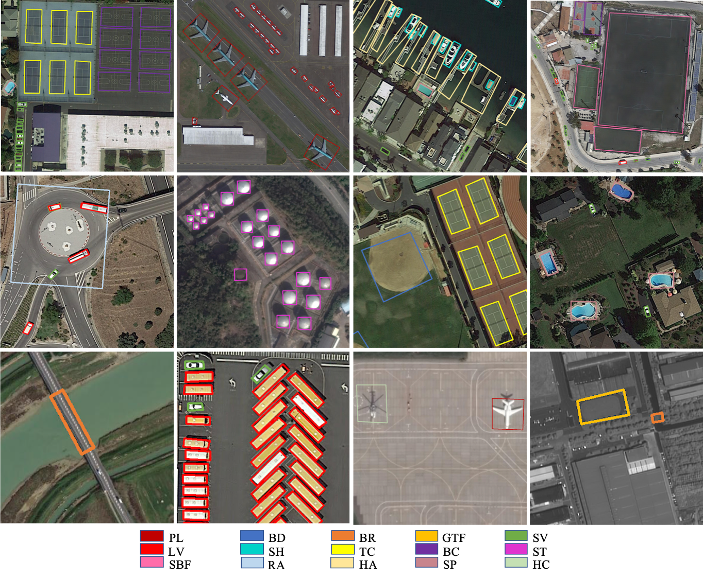

# OPLD:Learning Point-guided Localization for Detection in Remote Sensing Images

Official implementation of **Learning Point-guided Localization for Detection in Remote Sensing Images**

In this repository, we release the OPLD code in Pytorch.

- OPLD architecture:
<p align="center"></p>

- OPLD output on DOTA:
<p align="center"></p>


## Installation
- 4 x TITAN X GPU
- pytorch1.1
- python3.6.8

Install OPLD following [INSTALL.md](https://github.com/yf19970118/OPLD-Pytorch/blob/master/INSTALL.md).


**ImageNet pretrained weight**

- [R-50](https://drive.google.com/open?id=1EtqFhrFTdBJNbp67effArVrTNx4q_ELr)
- [R-50-GN](https://drive.google.com/open?id=1LzcVD7aADhXXY32DdtKhaY9hTXaduhlg)
- [X-101-32x8d](https://drive.google.com/open?id=1c4OSVZIZtDT49B0DTC0tK3vcRgJpzR9n)


## Training

To train a model with 4 GPUs run:
```
CUDA_VISIBLE_DEVICES=0,1,2,3 python -m torch.distributed.launch --nproc_per_node=4 tools/train_net.py  --cfg cfgs/DOTA/e2e_OPLD_R-50-FPN_1x.yaml
```


## Evaluation

### multi-gpu coco evaluation,
```
python tools/test_net.py --cfg ckpts/DOTA/e2e_OPLD_R-50-FPN_1x/e2e_OPLD_R-50-FPN_1x.yaml --gpu_id 0,1,2,3
```

### single-gpu coco evaluation,
```
python tools/test_net.py --cfg ckpts/DOTA/e2e_OPLD_R-50-FPN_1x/e2e_OPLD_R-50-FPN_1x.yaml --gpu_id 0
```


## License
OPLD is released under the [MIT license](https://github.com/yf19970118/OPLD-Pytorch/blob/master/LICENSE).
